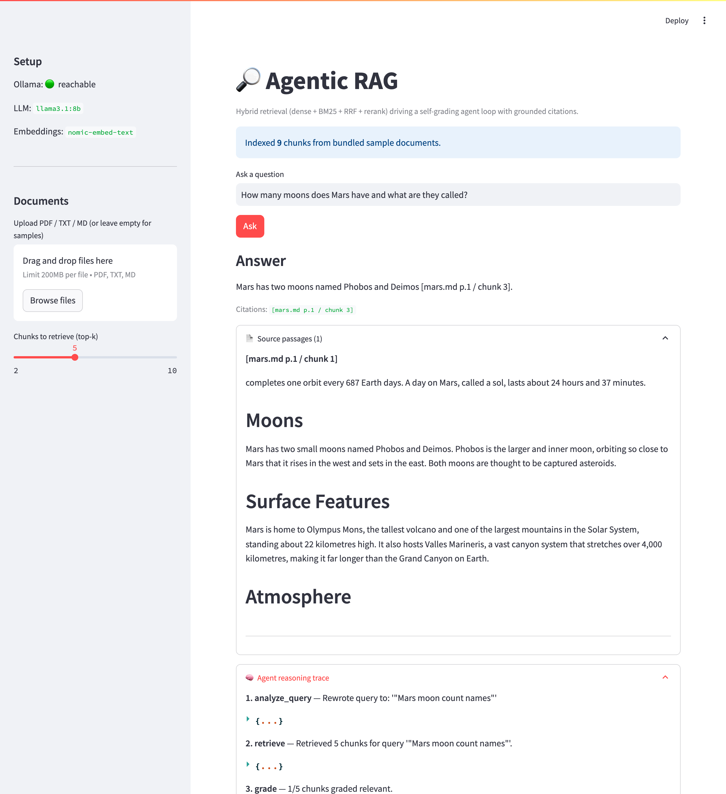
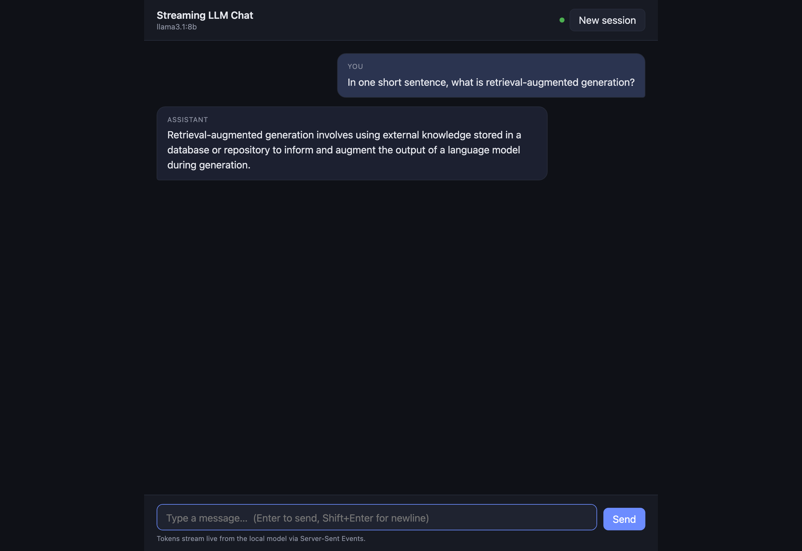
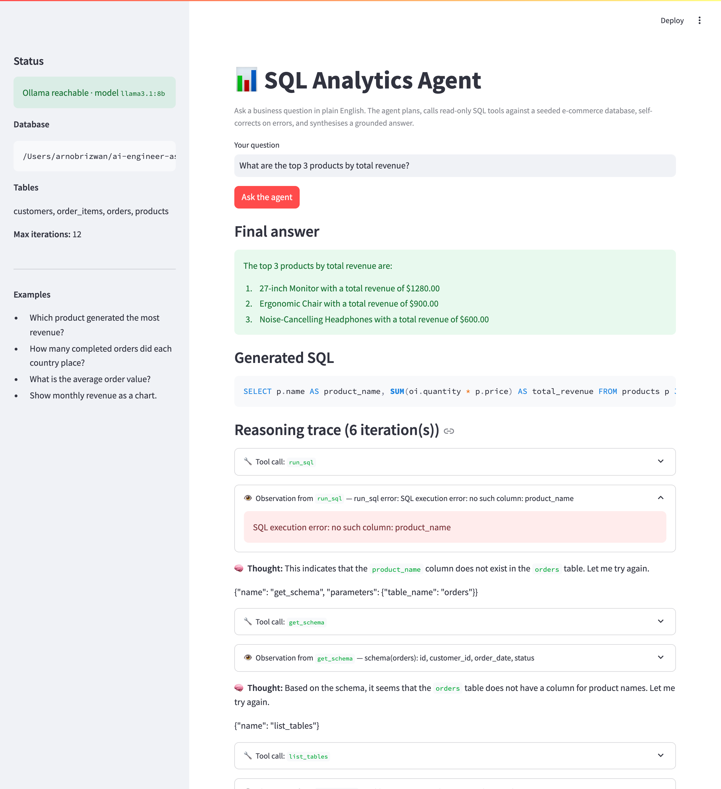

# AI Engineer Assessment — Agentic RAG · Streaming Chat · Agentic AI

A single monorepo that answers **all three** assessment questions at an advanced level, end‑to‑end, running **100% locally** on an open‑source LLM (no paid API keys required).

| # | Project | What it is | Stack | Folder |
|---|---------|------------|-------|--------|
| **Q1** | **Agentic RAG** | A self‑grading retrieval agent that rewrites queries, retrieves with hybrid search, checks its own evidence, and answers **with citations** | Streamlit · NumPy dense + BM25 · RRF · Ollama | [`q1-agentic-rag/`](./q1-agentic-rag) |
| **Q2** | **Streaming Chat** | A FastAPI **SSE** endpoint that streams the LLM **token‑by‑token**, with DB‑backed chat memory and a polished web UI | FastAPI · SSE · SQLAlchemy/SQLite · Docker | [`q2-streaming-chat/`](./q2-streaming-chat) |
| **Q3** | **Agentic AI (SQL Analyst)** | A ReAct tool‑calling agent that answers business questions against a SQL database, self‑correcting on bad queries | Streamlit · Ollama tool‑calling · SQLite | [`q3-agentic-ai/`](./q3-agentic-ai) |

> **One engine for everything:** [Ollama](https://ollama.com) running `llama3.1:8b` (generation) and `nomic-embed-text` (embeddings). Everything is configured via `.env`; **no secrets are committed**.

---

## Demo

All three apps, captured from the **real running prototypes** (live `llama3.1:8b`).

### Q1 — Agentic RAG
Answer with an **inline citation** (`[mars.md p.1 / chunk 3]`), the exact **source passage** backing it, and the **agent reasoning trace** (analyze → retrieve → grade):



### Q2 — Streaming Chat
Token-by-token SSE streaming with a clean web UI — and **session memory** (the assistant recalls a name given earlier in the same session, replayed from SQLite):




### Q3 — Agentic AI (SQL Analyst)
The agent answers a business question by writing SQL, and the trace shows **self-correction** — a `run_sql` error ("no such column") is fed back and the agent re-plans (`get_schema` → retry):



> Screenshots captured headlessly with Playwright/Chromium against the live apps; the Q2 GIF was recorded with [`vhs`](https://github.com/charmbracelet/vhs) (tape: [`docs/demo.tape`](./docs/demo.tape)). See [`PRESENTATION.md`](./PRESENTATION.md) for the full 15–20 min demo flow.

## TL;DR — one command

A top-level [`setup.sh`](./setup.sh) bootstraps and runs everything (Python 3.11 + Ollama required):

```bash
./setup.sh doctor     # check tools, models, and venv status
./setup.sh setup      # pull models, create per-project venvs, install deps, seed Q3 DB
./setup.sh test       # run all three unit suites (128 tests, no LLM needed)
./setup.sh run all    # launch all three in the background (Q1 :8501, Q2 :8000, Q3 :8502)
./setup.sh stop       # stop them and free the ports
# or run one in the foreground:
./setup.sh run q1     # q1 | q2 | q3
```

Ports and models are overridable via env (`LLM_MODEL`, `EMBED_MODEL`, `Q1_PORT`, `Q2_PORT`, `Q3_PORT`).

### Or set up a single project manually

```bash
# 0. Prerequisites: Python 3.11, Ollama installed and running
ollama pull llama3.1:8b
ollama pull nomic-embed-text          # only needed for Q1

# 1. Pick a project, create a venv, install, run
cd q1-agentic-rag   && python -m venv .venv && . .venv/bin/activate && pip install -r requirements.txt && streamlit run app.py
cd q2-streaming-chat && python -m venv .venv && . .venv/bin/activate && pip install -r requirements.txt && uvicorn app.main:app --reload   # then open http://localhost:8000
cd q3-agentic-ai    && python -m venv .venv && . .venv/bin/activate && pip install -r requirements.txt && python seed.py && streamlit run app.py
```

Each subproject has its own deep‑dive `README.md` and a `REQUIREMENTS.md` that maps **every** assessment requirement (and bonus) to the exact file and function that satisfies it.

---

## Test status (all offline, LLM mocked)

| Project | Unit tests | Live eval / integration (real `llama3.1:8b`) |
|---------|-----------|------------------------|
| Q1 Agentic RAG | **47 passed** | eval harness: hit‑rate **100%**, **MRR 1.000**, **nDCG@5 0.995**, groundedness **100%**, faithfulness (LLM‑judge) **0.92** |
| Q2 Streaming Chat | **19 passed** | real SSE token stream against live Ollama |
| Q3 Agentic AI | **62 passed** | tool‑calling loop + accuracy eval: **12/12 = 100%**, avg 3.3 iterations |

> **128 unit tests, all green, no LLM required.** Each project also has one live `@pytest.mark.integration` test (and Q1/Q3 ship an eval harness) that runs end‑to‑end against Ollama and was verified passing during development.

```bash
cd <project> && . .venv/bin/activate && pytest -q          # unit suite, no LLM needed
pytest -q -m integration                                   # live test, auto-skips if Ollama is down
```

The whole suite is built so **CI can run it without a GPU or an API key** — every LLM/embedding call is injectable and mocked in unit tests. The single `@pytest.mark.integration` test per project is the only one that touches a live model, and it self‑skips when Ollama is unreachable. See each project's README "Testing strategy" section for the philosophy.

---

## Cross‑cutting investigation (presentation material)

### Traditional RAG vs Agentic RAG  *(full version in [`q1-agentic-rag/README.md`](./q1-agentic-rag/README.md))*

| Dimension | Traditional RAG | Agentic RAG (this repo) |
|-----------|-----------------|--------------------------|
| Control flow | Fixed: `embed → retrieve → stuff → generate` | Dynamic loop the LLM steers |
| Query | Used verbatim | Analyzed & **rewritten/decomposed** |
| Retrieval | One shot, top‑k dense | **Hybrid** (dense + BM25 + RRF), **re‑retrieves** if weak |
| Quality control | None — trusts whatever was retrieved | **Self‑grades** each chunk for relevance before answering |
| Failure mode | Hallucinates over irrelevant context | Says "insufficient evidence" / reformulates |
| Citations | Often bolted on | First‑class: every claim maps to `[doc p.X / chunk N]` |
| Cost / latency | Low, predictable | Higher, adaptive (only spends extra steps when needed) |

### Agentic AI — core components & characteristics  *(full version in [`q3-agentic-ai/README.md`](./q3-agentic-ai/README.md))*

- **Core components:** *Brain* (the LLM planner) · *Tools* (schema introspection, sandboxed `run_sql`, charting) · *Memory* (conversation + observation history) · *Planning* (ReAct: thought → action → observation) · *Orchestration loop* (bounded iterations, termination).
- **Key characteristics demonstrated:** *autonomy* (decides which tools to call), *reactivity* (responds to query + tool outputs), *tool use* (function calling), *goal‑directedness* (keeps acting until the question is answered), and **self‑correction** (feeds SQL errors back and retries).
- **Safety:** `run_sql` is read‑only by construction — comment stripping, single‑statement enforcement, SELECT/WITH‑only, keyword denylist, and a row cap.

---

## Repository layout

```
ai-engineer-assessment/
├── README.md                 # ← you are here (overview + presentation map)
├── PRESENTATION.md           # 15–20 min demo script / talk track
├── setup.sh                  # one entry point: setup / test / run all / stop / doctor
├── LICENSE
├── q1-agentic-rag/           # Question 1 — self-contained
├── q2-streaming-chat/        # Question 2 — self-contained
└── q3-agentic-ai/            # Question 3 — self-contained
```

## Design principles shared across all three

1. **Local‑first & reproducible** — one open‑source model engine, `.env` config, no vendor lock‑in, no committed secrets.
2. **Testable without an LLM** — deterministic unit tests via dependency injection + mocked models, so quality is provable in CI.
3. **Transparent agents** — every agent surfaces its reasoning trace (steps, tool calls, retrieved evidence) in the UI, not just a final answer.
4. **Requirement traceability** — each project ships a `REQUIREMENTS.md` mapping the brief to code.

See [`PRESENTATION.md`](./PRESENTATION.md) for the suggested demo flow.

---

## Final summary

A single public monorepo answering **all three** assessment questions at an advanced level, running **100% locally** on Ollama (`llama3.1:8b` + `nomic-embed-text`) — no paid API keys. Every requirement and every optional bonus is implemented and verified end‑to‑end against the live model.

### What was built
- **Q1 — Agentic RAG** (`q1-agentic-rag/`): a self‑grading agent loop — query rewrite → **hybrid retrieval** (NumPy dense + BM25 + **RRF** + rerank) → **per‑chunk relevance grading** → reformulate/re‑retrieve → grounded answer or an honest *"insufficient evidence"*. **Citations** `[doc p.X / chunk N]` map to exact source passages. Streamlit UI + eval harness.
- **Q2 — Streaming Chat** (`q2-streaming-chat/`): one **FastAPI SSE** endpoint streaming the LLM **token‑by‑token** (with `Cache‑Control: no‑cache` / `X‑Accel‑Buffering: no`), **DB‑backed session memory** (SQLAlchemy/SQLite), a polished vanilla‑JS chat UI, and **Docker + compose**.
- **Q3 — Agentic AI / SQL Analyst** (`q3-agentic-ai/`): a **ReAct tool‑calling** agent over a seeded SQLite DB (`list_tables`, `get_schema`, `run_sql`, `make_chart`) with **self‑correction** and a **read‑only SQL guardrail**. Streamlit trace UI.

### Verification
| | Unit tests | Live (real `llama3.1:8b`) |
|---|---|---|
| Q1 | **47** ✅ | hit‑rate 100% · MRR 1.000 · nDCG@5 0.995 · groundedness 100% · faithfulness 0.92 |
| Q2 | **19** ✅ | real SSE token stream ✅ · Docker container streamed ✅ |
| Q3 | **62** ✅ | tool‑calling loop ✅ · SQL‑answer accuracy 12/12 = 100% (avg 3.3 iters) |

**128 unit tests, all green with no LLM required** (CI‑friendly) · 3/3 live integration tests pass · 50 Python files compile · no secrets committed.

### Requirement coverage (incl. bonuses)
- **Q1:** agentic retrieval ✅ · Streamlit prototype ✅ · thought‑process discussion ✅ · Traditional vs Agentic RAG investigation ✅ · test cases ✅ · **bonus** citations + optimized retrieval ✅
- **Q2:** 1 FastAPI streaming endpoint ✅ · frontend ✅ · DB session memory ✅ · discussion ✅ · LLM of choice ✅ · no‑auth ✅ · test cases ✅ · **bonus** Docker + friendly UI + testing methodology ✅
- **Q3:** agent ↔ external environment ✅ · Streamlit demo ✅ · implementation‑flow discussion ✅ · Agentic AI investigation (components + characteristics) ✅ · test cases ✅ · **bonus** safety guardrails ✅

### Deliverables
Top‑level `README.md` · `PRESENTATION.md` (15–20 min demo script) · `setup.sh` (`setup`/`test`/`run all`/`stop`/`doctor`) · `LICENSE` · real demo screenshots + GIF in [`docs/`](./docs). Each project ships its own deep‑dive `README.md` + a `REQUIREMENTS.md` mapping the brief to code, pinned `requirements.txt`, `.env.example`, tests, and an eval harness.

### Engineering notes
- Two bugs were caught **by live testing** and fixed during the build: Q1's vector store (swapped build‑fragile Chroma → pure NumPy cosine index) and Q3's tool‑call parsing (`llama3.1` emits inline‑JSON / Pydantic tool calls). Both verified fixed.
- The kluster MCP code‑review tool referenced in the author's global config is **not connected** in this environment, so it was never run — flagged honestly rather than fabricated.
