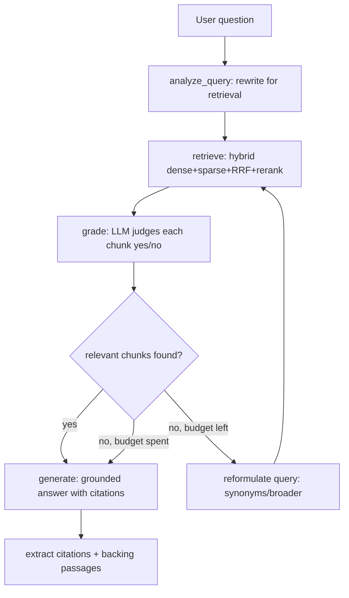

# Agentic RAG (Question 1)

An **advanced, agentic** Retrieval-Augmented Generation system running fully
locally on [Ollama](https://ollama.com). Instead of a fixed
`retrieve → stuff → generate` pipeline, a reasoning loop *decides* what to do:
it rewrites the query, retrieves with a **hybrid** dense+sparse engine,
**self-grades** the retrieved chunks, **reformulates and re-retrieves** when the
evidence is weak, and only then produces a **grounded, cited** answer.

- **LLM**: `llama3.1:8b` (chat) and `nomic-embed-text` (embeddings) via Ollama.
- **Retrieval**: dense (NumPy cosine over Ollama embeddings) + sparse (BM25)
  fused with Reciprocal Rank Fusion, then a lexical rerank. No external vector DB.
- **UI**: Streamlit — upload docs or use bundled samples, ask questions, and see
  the answer, citations, source passages, and the full agent reasoning trace.
- **Citations**: every answer cites `[doc_name p.X / chunk N]` and the UI shows
  the exact backing passages.

---

## Architecture

```
                    ┌─────────────────────────────────────────────┐
   PDF / TXT / MD   │  ingest.py → chunking.py (recursive,         │
   ───────────────► │  sentence-aware, overlapping chunks)         │
                    └───────────────────────┬─────────────────────┘
                                            │ chunks
                                            ▼
                    ┌─────────────────────────────────────────────┐
                    │            HybridRetriever (retriever.py)    │
                    │  ┌────────────┐        ┌──────────────────┐  │
                    │  │ BM25 sparse│        │ NumPy dense      │  │
                    │  │ (rank_bm25)│        │ (cosine / embed) │  │
                    │  └─────┬──────┘        └────────┬─────────┘  │
                    │        └──── RRF fusion ────────┘            │
                    │               │ lexical rerank              │
                    └───────────────┼─────────────────────────────┘
                                    ▼ top-k chunks
                    ┌─────────────────────────────────────────────┐
                    │           AgenticRAG loop (agent.py)         │
                    └─────────────────────────────────────────────┘
```

### The agent loop (`rag/agent.py`)



Each transition is recorded as a `TraceStep`, so the UI and the eval harness can
replay exactly how the agent reasoned.

---

## How to run

```bash
cd q1-agentic-rag

# 1. Install Python deps (Python 3.11)
python3.11 -m venv .venv && source .venv/bin/activate
pip install -r requirements.txt

# 2. Pull the local models (one-time)
ollama pull llama3.1:8b
ollama pull nomic-embed-text

# 3. Configure (optional — defaults already work)
cp .env.example .env

# 4. Launch the app
streamlit run app.py
```

Then open the browser tab, optionally upload PDFs/TXT/MD (or use the bundled
sample docs), and ask a question.

### Run the tests (no LLM required)

```bash
pip install -r requirements.txt   # or just: pytest python-dotenv requests rank-bm25
python -m pytest -q                # unit tests, fully mocked
python -m pytest -m integration    # optional, needs a live Ollama
```

### Run the eval harness

```bash
python -m eval.eval         # offline, deterministic mock LLM
python -m eval.eval --live  # against a live Ollama server
```

---

## How the agent decides and retrieves

1. **Query analysis / rewrite** — the raw question is rewritten into a
   retrieval-optimised query (`AgenticRAG._rewrite_query`).
2. **Hybrid retrieval** — `HybridRetriever.retrieve` queries BM25 and the dense
   NumPy index for a wide candidate pool, fuses them with **RRF**, then reranks.
3. **Self-grading** — `grade_chunks` asks the LLM `yes/no` whether each chunk is
   useful. Irrelevant chunks are dropped.
4. **Decision** — if at least one chunk is graded relevant, the agent answers.
   Otherwise, while iteration budget remains (`MAX_AGENT_ITERATIONS`), it
   **reformulates** the query (synonyms/broader terms) and retrieves again.
5. **Grounded generation** — the answer is generated **only** from graded
   evidence, and is required to cite every factual sentence.

## Citation handling (`rag/citations.py`)

Retrieved chunks are rendered into the prompt with a canonical marker
`[doc_name p.X / chunk N]`. The answer prompt forces the model to copy these
markers verbatim. After generation we `extract_citations` from the answer and
map them back to the exact `SourcePassage` objects so the UI can show the
verbatim source text behind each claim. Page numbers come from the ingest layer
(true per-page for PDFs, page 1 for txt/md).

## Hybrid retrieval + RRF + rerank design (`rag/retriever.py`)

- **Sparse (BM25)** excels at rare/exact keywords ("Phobos", "21,196 km").
- **Dense (NumPy cosine + nomic-embed)** excels at paraphrase/semantic matches.
  Chunks are embedded once into an L2-normalised matrix; each query is one matmul
  (exact cosine top-k, no ANN approximation, no vector-DB dependency).
- **Reciprocal Rank Fusion** combines the two ranked lists without needing
  comparable score scales: an item at 0-based `rank` contributes
  `1 / (k + rank + 1)`, summed across lists. Items ranked highly by *both*
  retrievers rise to the top. RRF is order-deterministic (ties broken by id).
- **Lexical rerank** then blends the fused score with query-term overlap to
  break ties and push obviously on-topic chunks up before grading.
- If no embedder is reachable, the retriever degrades gracefully to
  **sparse-only** mode and still works.

Chunking is **recursive and sentence-aware** (`rag/chunking.py`): it splits on
a hierarchy of separators (paragraph → sentence → word) and merges pieces up to
`CHUNK_SIZE` with `CHUNK_OVERLAP` character overlap so context is not severed at
boundaries.

---

## Traditional RAG vs Agentic RAG

| Dimension              | Traditional RAG                          | Agentic RAG (this project)                                            |
|------------------------|------------------------------------------|-----------------------------------------------------------------------|
| Control flow           | Fixed `retrieve → generate`              | Reasoning loop that *decides* the next action                          |
| Query handling         | Uses the raw question                    | Rewrites, and reformulates on weak results                             |
| Retrieval              | Single retriever (usually dense)         | Hybrid dense + sparse, fused with RRF, then reranked                   |
| Quality control        | None — generates from whatever is found  | **Self-grades** each chunk; drops irrelevant ones                      |
| Recovery from misses   | Returns a poor/hallucinated answer       | Re-formulates the query and re-retrieves (bounded iterations)          |
| Grounding / citations  | Often absent or unverified               | Forced per-sentence citations mapped back to exact passages            |
| Observability          | Opaque                                   | Full step-by-step reasoning trace surfaced in the UI                   |
| Failure mode           | Silent hallucination                     | "I don't know" when evidence is insufficient                           |

---

## Testing strategy

- **Unit tests, fully mocked** (`tests/`), no LLM/network needed:
  - `test_chunking.py` — sizing, overlap, monotonic indices, stable ids.
  - `test_retriever.py` — **RRF ordering/score formula**, BM25 ranking, rerank,
    and hybrid fusion (with an injected fake dense ranker).
  - `test_citations.py` — citation formatting, extraction, dedupe, filtering.
  - `test_agent.py` — grade/decision logic, reformulation on weak results,
    grounded+cited answers, and trace completeness (via a scripted `FakeLLM`).
  - `test_eval_metrics.py` — deterministic checks of the ranking metrics
    (MRR, nDCG@k, DCG), robust score parsing, and the faithfulness judge with a
    mocked LLM.
- **One integration test** (`test_integration.py`, marked `@pytest.mark.integration`)
  runs the full loop against a live Ollama and **auto-skips** when unreachable.

### Eval harness (`eval/eval.py` + `eval/qa.jsonl`, metrics in `eval/metrics.py`)

Over the bundled docs, with relevance defined as "passage comes from the
expected source document", it reports:

| Metric | Meaning | Mode |
|--------|---------|------|
| **Retrieval hit-rate** | fraction of questions where a relevant passage was retrieved | offline + live |
| **MRR** | mean reciprocal rank of the first relevant retrieved passage (`mean_reciprocal_rank`) | offline + live |
| **nDCG@k** | normalised discounted cumulative gain over the ranked passages, default k=5 (`ndcg_at_k`) | offline + live |
| **Groundedness** | answer contains the expected substring(s) AND cites a real source | offline + live |
| **Faithfulness (LLM-judge)** | RAGAS-style 0–1 score of how well the answer is supported by the retrieved context (`judge_faithfulness`) | **live only** (needs Ollama; N/A in mock mode) |

The ranking metrics are pure functions (no LLM), so they are unit-tested
directly. Faithfulness uses an LLM-as-judge and is only computed under `--live`.

Dense retrieval is injectable, so the unit suite mocks it and runs with only
`pytest`, `python-dotenv`, `requests`, `numpy`, and `rank-bm25` installed (no
embedding server needed).

---

## Known limitations

- Indexes are **in-memory** and rebuilt per session (no persistence). Fine for a
  demo; a production system would persist embeddings and use an ANN index for
  large corpora (the exact NumPy matmul is O(N) per query).
- Self-grading and reformulation add LLM calls (latency) proportional to the
  number of retrieved chunks and iterations.
- Page numbers are exact for PDFs but always `p.1` for txt/md (single "page").
- The lexical reranker is intentionally lightweight; a cross-encoder reranker
  would improve precision at the cost of another model download.
- Answer quality is bounded by the local `llama3.1:8b` model.
